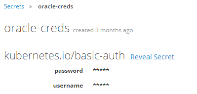

# Python Oracle Connector

This repo is responsible for creating an image that consists of python and an Oracle database.

In order to build image use Docker Build strategy in openshift. It's built on top of the python s2i image so if you want to use this as a base image you can use this as the same way as the python s2i image.

Oracle Documentation:
https://www.oracle.com/database/technologies/instant-client/linux-x86-64-downloads.html

# Setting up an ODBC Connection on Containers

## Why
If you have an application running inside an enterprise, and this application is running inside of a container, then you have some special considerations. Since the container will run your application as an anonymous user, it is not able to authenticate automatically with ODBC. In addition, a container will only have the minimum packages installed, meaning it is likely missing the necessary drivers to talk to a database.

## What you need
-	Service Account for an Oracle Database
-	Secret for Credentials
-	Driver Layer for Image
-	Configuration of Application

## Service Account
The first thing you’re going to need for access to an Oracle Database is a service account for your application to use. Authentication can be handled in two ways. The first is to create a keytab for the service account and inject this into your application to access an Oracle Database. The other way is to create a username/password in an Oracle Database for the service account and use those to authenticate. We went with the latter approach.

The process is: 
* Request Windows Service Account
* Request Oracle Service Account
* Request DB Access for Oracle Service Account
* Request permission to use Service Account in application

### Windows Service Account
You won’t use the Windows service account in your end application, but your Oracle service account needs to be linked to a Windows service account for management purposes.

### Oracle Service Account
Once you have the Windows service account, you can request the Oracle service account that will be used to access the database.

### DB Access for Service Account
You will need to put in a request for the account to be granted access to the particular databases that you need access to for your application.

### Usage Permission for Service Account
Once your service account has been created and granted access to your database, you must request permission to use this service account in your end application, to assure it is being used in an approved manner.


## OpenShift Secret
Once you have a Service Account in Oracle with a Username and Password, you can use this to access an Oracle Database. In order for your application to have those credentials, they must somehow make it into your application. Since adding credentials to your source code repository is a bad idea, you should add them to your OpenShift project as a Secret. Alternatively, depending on what your application is, you may be able to enter the credentials during runtime. Or use some other key management system.


To make a secret, in your OpenShift UI, go to:
* Resources
* Secrets 
* Select “Create Secret”



## Driver Layer for Image
If connecting to a database from a VM or locally, you must have the appropriate drivers installed that allow for communication with the database. The same goes for a container. The container in most cases will not come with drivers pre-installed, so we need to add them, as an additional layer, in a Dockerfile. If you are unfamiliar with Dockerfiles and OpenShift Builds, please refer to the Containers 101 and 201 courses.

In order to connect to an an Oracle Database, an Oracle database, we need the appropriate drivers, in this case Oracle Instant Client and Unix ODBC. We installed these packages, the necessary dependencies, and configured the environment to make it run, all in a Dockerfile.
  
This is built on top of our existing image, which keeps our app the same, only adding in these additional dependencies / configurations.


## Application Configuration
Finally, we need to configure our application to connect to the database. First, we need to inject our username and password into the environment in our Deployment Config (you can learn about this in the Containers 201 course).
 
Finally, in our notebook, we access an Oracle Database using our Username and Password, using the python cx_Oracle module:

```
dsn ='(DESCRIPTION =(ADDRESS_LIST =(ADDRESS =(PROTOCOL = TCP)(HOST = db.example.com)(PORT =55001)))(CONNECT_DATA =( SID = USASDB)))'
db_conn = cx_Oracle.connect(user,pwd,dsn)
cursor = db_conn.cursor()
```